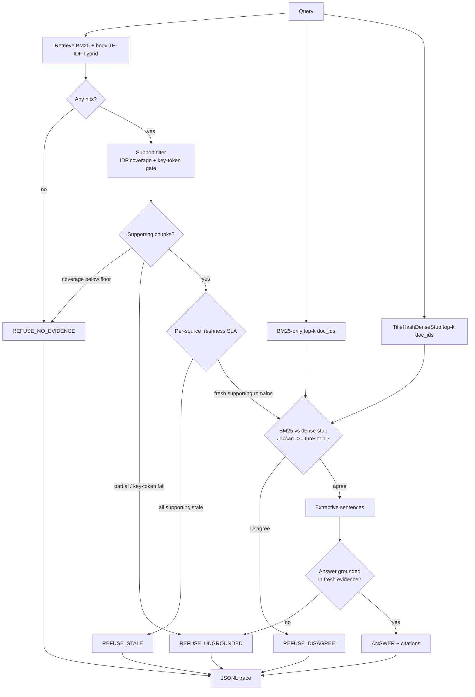

# Freshness-gated ops copilot

Most RAG demos answer from whatever chunk ranks high. This project is an
**ops knowledge copilot that refuses to answer when evidence fails a freshness
SLA, a grounding check, or a retriever-agreement check**. Freshness and
disagreement are first-class gates — hiring signal for live-data / production-agent roles.

A stale runbook that still BM25-matches "Redis maxmemory-policy" is not an
answer. A fresh feature-flag page that never mentions a rollback procedure is
not an answer. When BM25 and a second dense stub disagree on top evidence, a
fluent answer is also not safe. The system has five structured decisions:

| Decision | Meaning |
| --- | --- |
| `ANSWER` | Fresh, supporting evidence passed grounding; extractive sentences only |
| `REFUSE_STALE` | The chunks that would actually support the query are older than the SLA |
| `REFUSE_UNGROUNDED` | Retrieval found something related; it does not support the ask |
| `REFUSE_NO_EVIDENCE` | Nothing in the corpus is about this query |
| `REFUSE_DISAGREE` | BM25 and the title-hash dense stub disagree on top-k doc_ids |

No paid LLM is required. CI is offline, seeded, and clock-frozen.

## Hypothesis (2026-09-16 disagreement routing)

1. BM25 and a second retriever (offline dense stub via title char-hash cosine) often disagree on top evidence; forcing agreement before `ANSWER` reduces silent wrong answers.
2. When top-k doc-id sets disagree beyond a Jaccard threshold, policy should `REFUSE_DISAGREE` even if freshness passes.
3. Golden cases can show flips vs a BM25-only path; report `disagreement_rate` + `decision_accuracy`.

Prior (2026-09-15): FastAPI demo surface. Prior (2026-09-14): per-source SLAs + Actions.

## Why this is not another RAG demo

Typical RAG: embed → top-k → generate. Staleness and ranker conflict, if they
appear at all, are footnotes the model is free to ignore.

This repo inverts that. **Freshness is applied to supporting evidence, not to
whatever ranked high.** **Disagreement is checked after freshness and before
grounding** so an extractive draft cannot paper over BM25 vs dense-stub conflict.
A live Redis pool chart cannot launder a March maxmemory-policy runbook. A
hyphenated title FAQ that char-hash cosine loves cannot override a terse config
that BM25 prefers — the system refuses instead.

## Architecture



Clock is frozen at `2026-09-13T00:00:00+00:00` (`EVAL_CLOCK`). Default mode:
**per-source SLAs** + **disagreement gate** (`disagreement_top_k=1`,
`disagreement_jaccard_threshold=1.0` → top evidence doc_ids must match).

The second retriever is `TitleHashDenseStub`: `HashingVectorizer(analyzer=char_wb)`
cosine over **titles** — an offline stand-in for dense embeddings. Hyphenated
title decoys that BM25 treats as a single token still match spaced queries via
character n-grams, which is how the disagreement traps are constructed.

## Corpus

`data/corpus/ops_docs.jsonl` — 47 synthetic ops docs including mixed-SLA fixtures
and four disagreement-trap families (mesh budget, canary salt, WAL cadence,
trace reservoir) with terse configs + hyphenated title baits.

## Package

```
config/
  source_slas.yaml
src/ops_copilot/
  retrieve.py        BM25 + body TF-IDF hybrid; search_bm25; TitleHashDenseStub
  disagreement.py    Jaccard on top-k doc_ids; assess_disagreement
  disagreement_compare.py  BM25-only vs dual eval comparison
  policy.py          ANSWER | REFUSE_* including REFUSE_DISAGREE
  pipeline.py        retrieve → support → freshness → disagreement → extract → decide
  eval.py            golden runner + SLA comparison
  api.py             FastAPI: POST /query exposes disagreement block
```

## How to run

Python 3.10+. No API keys.

```bash
python -m pip install -e ".[dev,api]"
pytest
python scripts/run_demo.py
python scripts/run_eval.py
```

### FastAPI demo

```bash
python scripts/run_api.py
# curl POST /query — decisions include REFUSE_DISAGREE with a disagreement payload
```

`run_eval.py` writes `artifacts/eval_report.md`, `artifacts/eval_metrics.json`,
`artifacts/eval_comparison.{md,json}`, `artifacts/eval_disagreement.{md,json}`,
and `artifacts/traces.jsonl`.

## Golden eval (real run — 2026-09-16)

32 labeled cases on the frozen clock. Dual path (default) vs BM25-only
(`use_disagreement_gate=False`):

| Metric | BM25-only (gate off) | Dual disagreement |
| --- | ---: | ---: |
| cases | 32 | 32 |
| decision_accuracy | 1.000 | 1.000 |
| refusal_precision | 1.000 | 1.000 |
| refusal_recall | 1.000 | 1.000 |
| answer_grounding_rate | 1.000 | 1.000 |
| disagreement_rate | 0.344 | 0.344 |
| n_disagreed | 11 | 11 |
| decision flips vs other mode | 4 | 4 |

**4 decision flips** — BM25-only would `ANSWER` the trap queries; dual
emits `REFUSE_DISAGREE` (Jaccard 0.0 on top-1 doc_ids):

| Query | BM25-only | Dual |
| --- | --- | --- |
| sidecar mesh mtls handshake budget | `ANSWER` | `REFUSE_DISAGREE` |
| checkout canary stickiness salt | `ANSWER` | `REFUSE_DISAGREE` |
| payments WAL checkpoint cadence | `ANSWER` | `REFUSE_DISAGREE` |
| checkout trace sample reservoir size | `ANSWER` | `REFUSE_DISAGREE` |

Policy order: no-evidence → ungrounded support → stale → **disagree** → grounding → answer.

`pytest` : **64 passed** (includes disagreement matrix + API `REFUSE_DISAGREE` contract).

CI: [`.github/workflows/eval.yml`](.github/workflows/eval.yml) runs `pytest` and
`python scripts/run_eval.py` on every push/PR to `main`.

## Limitations

- **Lexical grounding is not entailment.** Token overlap plus a high-IDF
  key-token gate will miss paraphrase and will still pass some cleverly worded
  traps.
- **Title-hash dense stub is not a real embedding model.** It is a reproducible
  offline stand-in; production would swap in a local sentence encoder.
- **Top-k=1 agreement is strict.** Softening the Jaccard threshold / raising k
  trades silent-error reduction for answer coverage.
- **Synthetic corpus, frozen clock.** Useful for a reproducible hiring artifact;
  not a substitute for wiring PagerDuty / Grafana with their real `updated_at`.
- **Extractive only.** No generator means no fluent synthesis and no
  hallucination from an LLM.
- **Per-source SLAs are hand-tuned.** The YAML mapping is a research knob.
- **1.000 scores are on a crafted golden set.** Regression harness, not a claim
  about production traffic.
- **Demo API is single-process.** No auth, no multi-tenant isolation.

## Hiring takeaway

Production agents on live data need a refusal contract: *what evidence, how
old, did two independent rankers agree, did it actually support the ask, and
what do we do when any of those fail?* This repo is that contract in Python.
If you are hiring for ops / production-agent work, the interesting review is
`policy.py`, `disagreement.py`, `retrieve.py` (`TitleHashDenseStub`), and
`data/golden/questions.jsonl` — not the chat UI.

## License

MIT. Author: M.Varun (`116015799+Mavarun@users.noreply.github.com`).
