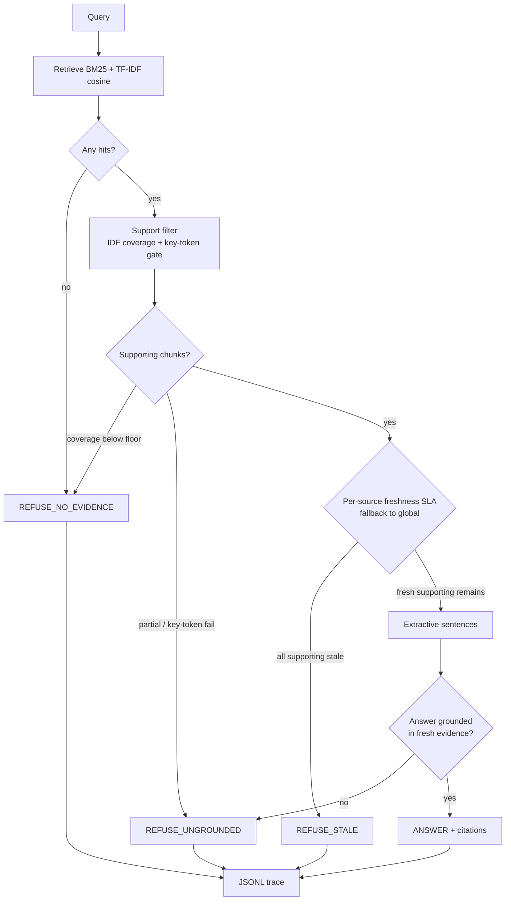

# Freshness-gated ops copilot

Most RAG demos answer from whatever chunk ranks high. This project is an
**ops knowledge copilot that refuses to answer when evidence fails a freshness
SLA or a grounding check**. Freshness is a first-class gate, not a footnote —
hiring signal for live-data / production-agent roles.

A stale runbook that still BM25-matches "Redis maxmemory-policy" is not an
answer. A fresh feature-flag page that never mentions a rollback procedure is
not an answer. The system has four structured decisions:

| Decision | Meaning |
| --- | --- |
| `ANSWER` | Fresh, supporting evidence passed the grounding gate; extractive sentences only |
| `REFUSE_STALE` | The chunks that would actually support the query are older than the SLA |
| `REFUSE_UNGROUNDED` | Retrieval found something related; it does not support the ask |
| `REFUSE_NO_EVIDENCE` | Nothing in the corpus is about this query |

No paid LLM is required. CI is offline, seeded, and clock-frozen.

## Hypothesis (2026-09-14 slice)

1. Different source systems need different freshness SLAs (e.g. live metrics 1h vs policy docs 7d); a single global SLA either over-refuses or under-protects.
2. Per-source SLA config should change refusal decisions on the same corpus vs global-only.
3. GitHub Actions running pytest + golden eval on PR protects regressions without paid LLM APIs.

## Why this is not another RAG demo

Typical RAG: embed → top-k → generate. Staleness, if it appears at all, is a
citation timestamp the model is free to ignore.

This repo inverts that. **Freshness is applied to supporting evidence, not to
whatever ranked high.** A live Redis pool chart cannot launder a March
maxmemory-policy runbook into an answer. A June on-call roster cannot override
today's rotation. The refusal is the product.

That is the production-agent problem: live ops data goes stale on a timescale
of hours, and a fluent wrong answer is worse than a structured no.

## Architecture



Clock is frozen at `2026-09-13T00:00:00+00:00` (`EVAL_CLOCK`) so ages, golden
labels, and CI do not drift. Override with `OPS_COPILOT_NOW` only for a live demo.

Default mode: **per-source SLAs** from `config/source_slas.yaml` (e.g. grafana 1h,
datadog 8h, confluence 168h) with `max_age_hours=48` as the fallback for unknown
sources. Set `CopilotConfig(use_source_slas=False)` for the v0 global-only path.
Inclusive: `age_hours <= max_age_hours` passes.

## Corpus

`data/corpus/ops_docs.jsonl` — 23 synthetic ops docs (PagerDuty, Statuspage,
runbooks, Kubernetes, Slack, Grafana, Datadog, LaunchDarkly, Jira, Confluence).

Includes mixed-SLA fixtures: a Confluence maintenance policy at ~62h (fails
global 48h, passes confluence 7d) and a Grafana live qps scrape at ~2.5h
(passes global 48h, fails grafana 1h).

## Package

```
config/
  source_slas.yaml   source_system → max_age_hours (+ global fallback)
src/ops_copilot/
  corpus.py          load JSONL, age relative to a clock, paragraph chunks
  retrieve.py        BM25 (rank_bm25, Okapi fallback) + TF-IDF cosine stub
  source_slas.py     YAML loader + resolve_max_age
  freshness.py       PASS/FAIL + age_hours (global or per-source lookup)
  grounding.py       IDF-weighted coverage + high-IDF key-token gate
  policy.py          ANSWER | REFUSE_STALE | REFUSE_UNGROUNDED | REFUSE_NO_EVIDENCE
  answer.py          extractive sentences, or a refusal template
  trace.py           JSONL: query, ids, ages, decision, latency_ms, cost units
  eval.py            golden runner + global vs per-source comparison
  pipeline.py        retrieve → support → freshness → extract → decide
.github/workflows/
  eval.yml           pytest + scripts/run_eval.py on push/PR
```

## How to run

Python 3.10+. No API keys.

```bash
python -m pip install -e ".[dev]"
pytest
python scripts/run_demo.py
python scripts/run_eval.py
```

`run_eval.py` writes `artifacts/eval_report.md`, `artifacts/eval_metrics.json`,
`artifacts/eval_comparison.md`, `artifacts/eval_comparison.json`, and
`artifacts/traces.jsonl`.

## Golden eval (real run — 2026-09-14)

28 labeled cases on the frozen clock. Default path uses per-source SLAs; the
harness also runs global-only (`max_age_hours=48`) on the same corpus. Measured
offline (no LLM).

| Metric | Global-only (48h) | Per-source SLAs |
| --- | ---: | ---: |
| cases | 28 | 28 |
| decision_accuracy | 1.000 | 1.000 |
| refusal_precision | 1.000 | 1.000 |
| answer_grounding_rate | 1.000 | 1.000 |
| refusal_recall | 1.000 | 1.000 |
| p50_latency_ms | 1.43 | 1.49 |
| p95_latency_ms | 2.06 | 1.68 |
| decision flips vs other mode | 4 | 4 |

**4 decision flips** on a fixed corpus — empirical confirmation of hypothesis 2:

| Query | Global-only | Per-source |
| --- | --- | --- |
| production maintenance change window | `REFUSE_STALE` | `ANSWER` |
| production freeze start | `REFUSE_STALE` | `ANSWER` |
| live payments-api request rate | `ANSWER` | `REFUSE_STALE` |
| payments-api live scrape qps | `ANSWER` | `REFUSE_STALE` |

Per-source confusion is diagonal: `ANSWER→ANSWER` 10, `REFUSE_STALE→REFUSE_STALE` 8,
`REFUSE_NO_EVIDENCE→REFUSE_NO_EVIDENCE` 5, `REFUSE_UNGROUNDED→REFUSE_UNGROUNDED` 5.

Full tables: [`artifacts/eval_report.md`](artifacts/eval_report.md),
[`artifacts/eval_comparison.md`](artifacts/eval_comparison.md).

`pytest` : **45 passed**.

CI: [`.github/workflows/eval.yml`](.github/workflows/eval.yml) runs `pytest` and
`python scripts/run_eval.py` on every push/PR to `main`.

## Limitations

- **Lexical grounding is not entailment.** Token overlap plus a high-IDF
  key-token gate will miss paraphrase and will still pass some cleverly worded
  traps. It is a kill-switch, not a fact checker.
- **Synthetic corpus, frozen clock.** Useful for a reproducible hiring artifact;
  not a substitute for wiring PagerDuty / Grafana with their real `updated_at`.
- **Extractive only.** No generator means no fluent synthesis and no
  hallucination from an LLM — also no multi-hop join across docs beyond
  concatenated sentences.
- **Per-source SLAs are hand-tuned.** The YAML mapping is a research knob, not
  a learned policy; real orgs would derive thresholds from incident postmortems.
- **BM25 + TF-IDF is not semantic.** Synonyms and implicit references fail
  closed. That is acceptable here because the refusal path is the point.
- **1.000 scores are on a crafted golden set.** They are a regression harness,
  not a claim about production traffic.
- **Cost units are synthetic.** There is no paid model in the CI path.

## Hiring takeaway

Production agents on live data need a refusal contract: *what evidence, how
old (and for which source), did it actually support the ask, and what do we do
when any of those fail?* This repo is that contract in Python, with a golden
set that punishes answering from stale or tangential chunks and a CI workflow
that re-checks the contract on every PR. If you are hiring for ops /
production-agent work, the interesting review is `policy.py`, `freshness.py`,
`config/source_slas.yaml`, and `data/golden/questions.jsonl` — not the retriever.

## License

MIT. Author: M.Varun (`116015799+Mavarun@users.noreply.github.com`).
