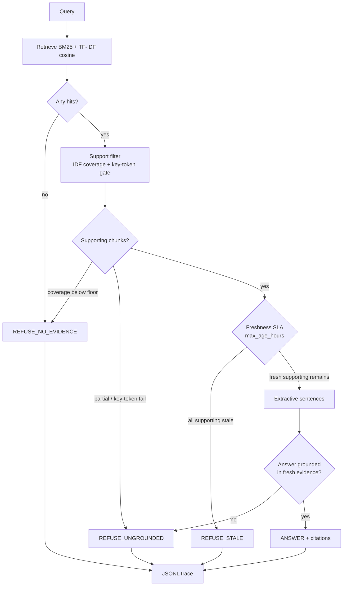

# Freshness-gated ops copilot

Most RAG demos answer from whatever chunk ranks high. This project is an
**ops knowledge copilot that refuses to answer when evidence fails a freshness
SLA or a grounding check**. Freshness is a first-class gate, not a footnote —
hiring signal for live-data / production-agent roles.

A stale runbook that still BM25-matches "Redis maxmemory-policy" is not an
answer. A fresh feature-flag page that never mentions a rollback procedure is
not an answer. The system has four structured decisions:

| Decision | Meaning |
| --- | --- |
| `ANSWER` | Fresh, supporting evidence passed the grounding gate; extractive sentences only |
| `REFUSE_STALE` | The chunks that would actually support the query are older than the SLA |
| `REFUSE_UNGROUNDED` | Retrieval found something related; it does not support the ask |
| `REFUSE_NO_EVIDENCE` | Nothing in the corpus is about this query |

No paid LLM is required. CI is offline, seeded, and clock-frozen.

## Why this is not another RAG demo

Typical RAG: embed → top-k → generate. Staleness, if it appears at all, is a
citation timestamp the model is free to ignore.

This repo inverts that. **Freshness is applied to supporting evidence, not to
whatever ranked high.** A live Redis pool chart cannot launder a March
maxmemory-policy runbook into an answer. A June on-call roster cannot override
today's rotation. The refusal is the product.

That is the production-agent problem: live ops data goes stale on a timescale
of hours, and a fluent wrong answer is worse than a structured no.

## Architecture



Clock is frozen at `2026-09-13T00:00:00+00:00` (`EVAL_CLOCK`) so ages, golden
labels, and CI do not drift. Override with `OPS_COPILOT_NOW` only for a live demo.

Default SLA: **48 hours**. Inclusive: `age_hours <= max_age_hours` passes.

## Corpus

`data/corpus/ops_docs.jsonl` — 21 synthetic ops docs (PagerDuty, Statuspage,
runbooks, Kubernetes, Slack, Grafana, Datadog, LaunchDarkly, Jira, Confluence).

12 are fresh against the frozen clock; 9 are intentionally stale (March Redis
policy, June on-call, Q1 blue-green, Nov auth TTL, April Kafka drain, Q1 SLO,
May payments-worker replicas, closed INC-3104). Several topics exist on both
sides of the SLA so the gate has to choose.

## Package

```
src/ops_copilot/
  corpus.py      load JSONL, age relative to a clock, paragraph chunks
  retrieve.py    BM25 (rank_bm25, Okapi fallback) + TF-IDF cosine stub
  freshness.py   PASS/FAIL + age_hours
  grounding.py   IDF-weighted coverage + high-IDF key-token gate
  policy.py      ANSWER | REFUSE_STALE | REFUSE_UNGROUNDED | REFUSE_NO_EVIDENCE
  answer.py      extractive sentences, or a refusal template
  trace.py       JSONL: query, ids, ages, decision, latency_ms, cost units
  eval.py        golden runner + refusal/grounding/latency metrics
  pipeline.py    retrieve → support → freshness → extract → decide
```

## How to run

Python 3.10+. No API keys.

```bash
python -m pip install -e ".[dev]"
pytest
python scripts/run_demo.py
python scripts/run_eval.py
```

`run_eval.py` writes `artifacts/eval_report.md`, `artifacts/eval_metrics.json`,
and `artifacts/traces.jsonl`.

## Golden eval (real run)

24 labeled cases: 8 fresh-ok, 6 stale-must-refuse, 5 no-evidence, 5 ungrounded
traps. Frozen clock, `max_age_hours=48`. Measured on the eval harness in this
repo (no LLM).

| Metric | Value |
| --- | ---: |
| cases | 24 |
| decision_accuracy | 1.000 |
| refusal_precision | 1.000 |
| refusal_recall | 1.000 |
| answer_grounding_rate | 1.000 |
| p50_latency_ms | 1.54 |
| p95_latency_ms | 1.87 |

Confusion is diagonal: `ANSWER→ANSWER` 8, `REFUSE_STALE→REFUSE_STALE` 6,
`REFUSE_NO_EVIDENCE→REFUSE_NO_EVIDENCE` 5, `REFUSE_UNGROUNDED→REFUSE_UNGROUNDED` 5.

Full case table: [`artifacts/eval_report.md`](artifacts/eval_report.md).

`pytest` : **34 passed**.

## Limitations

- **Lexical grounding is not entailment.** Token overlap plus a high-IDF
  key-token gate will miss paraphrase and will still pass some cleverly worded
  traps. It is a kill-switch, not a fact checker.
- **Synthetic corpus, frozen clock.** Useful for a reproducible hiring artifact;
  not a substitute for wiring PagerDuty / Grafana with their real `updated_at`.
- **Extractive only.** No generator means no fluent synthesis and no
  hallucination from an LLM — also no multi-hop join across docs beyond
  concatenated sentences.
- **One SLA for every source.** A Statuspage incident and a Confluence roster
  should not share `max_age_hours=48`. Per-source SLAs are the obvious next gate.
- **BM25 + TF-IDF is not semantic.** Synonyms and implicit references fail
  closed. That is acceptable here because the refusal path is the point.
- **1.000 scores are on a crafted golden set.** They are a regression harness,
  not a claim about production traffic.
- **Cost units are synthetic.** There is no paid model in the CI path.

## Hiring takeaway

Production agents on live data need a refusal contract: *what evidence, how
old, did it actually support the ask, and what do we do when any of those
fail?* This repo is that contract in ~400 lines of Python, with a golden set
that punishes answering from stale or tangential chunks. If you are hiring for
ops / production-agent work, the interesting review is `policy.py`,
`freshness.py`, and `data/golden/questions.jsonl` — not the retriever.

## License

MIT. Author: M.Varun (`116015799+Mavarun@users.noreply.github.com`).
